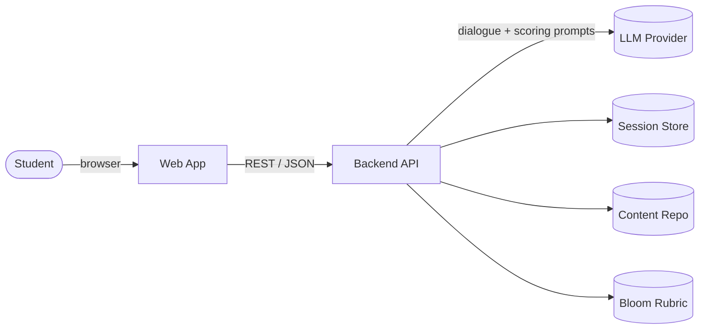
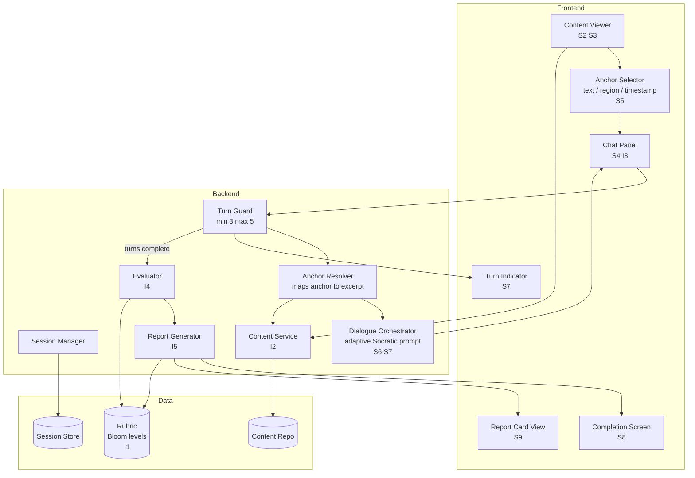
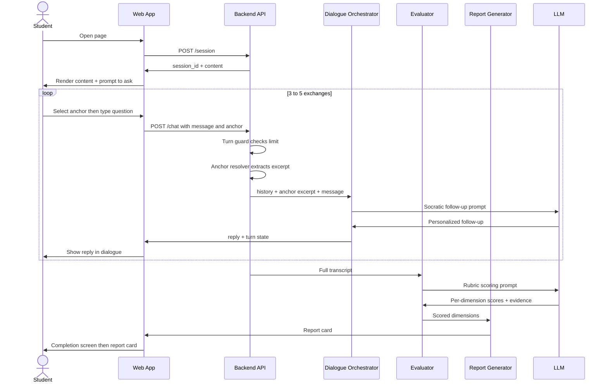
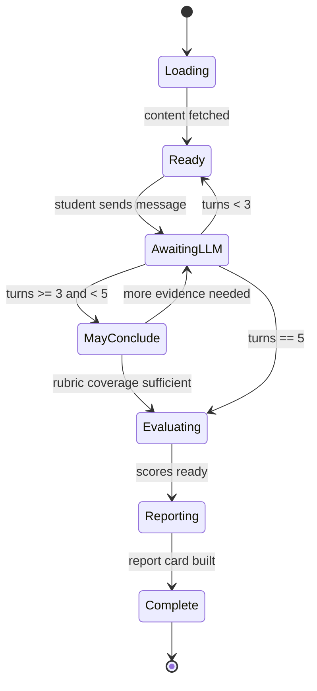
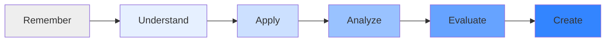
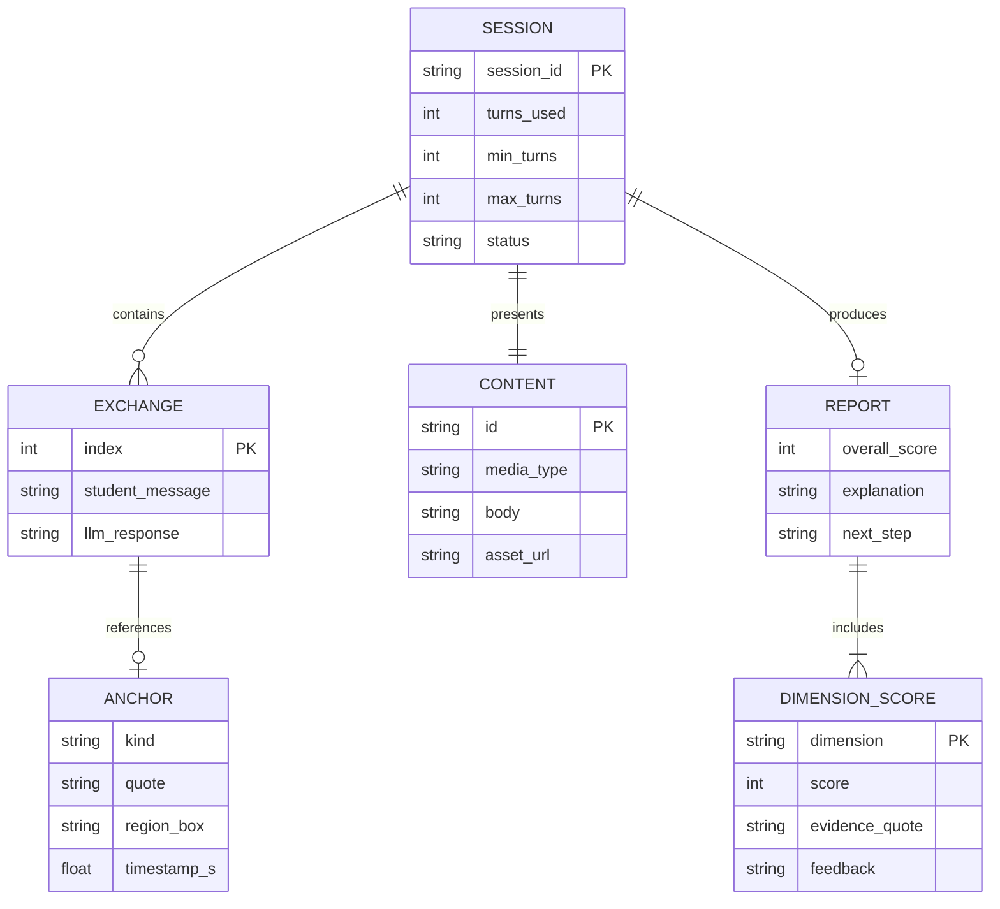

# Architecture — Critical Thinking MVP

## Requirements

### Infrastructure

| # | Requirement |
|---|-------------|
| I1 | A critical-thinking rubric for evaluating a student's level of critical thinking, based on Bloom's Taxonomy |
| I2 | A piece of content to present to the student as the basis for the interaction |
| I3 | A chatbot supporting a 3–5 turn conversational exchange, each message shown as ongoing dialogue |
| I4 | An evaluator that assesses the student's questions and responses against the rubric |
| I5 | A report generator that produces a critical-thinking report card |

### Student Experience

| # | Requirement |
|---|-------------|
| S1 | Student accesses the experience through a web page |
| S2 | Page displays content: text, images, diagrams, charts, animations, videos, or a combination |
| S3 | MVP ships exactly one piece of content |
| S4 | Interface prompts the student to ask a follow-up question or comment |
| S5 | Student can optionally **anchor** a question to part of the content — a text passage, an image/chart region, or a point in an animation/video |
| S6 | System responds with a personalized follow-up designed to deepen thinking |
| S7 | Back-and-forth of ~3–5 exchanges, each follow-up adapting to the previous response |
| S8 | Engaging completion screen at the end |
| S9 | Student receives a score, an explanation of the score, and rubric-tied feedback |

## System Context



## Component Architecture



## Interaction Flow



## Turn Policy

The exchange is a **range**, not a fixed count.



- **Minimum 3** exchanges guarantee enough transcript to score fairly.
- **Maximum 5** is a hard server-side stop.
- Between 3 and 5, the orchestrator ends early once every rubric dimension has observable evidence.

## Rubric (I1)

Bloom's Taxonomy provides the level ladder; each dimension is scored 1–4 with a required evidence quote from the transcript.



| Dimension | What it measures | Bloom anchor |
|---|---|---|
| Question Quality | Do questions move beyond recall toward analysis? | Remember → Analyze |
| Evidence & Reasoning | Are claims tied to the content? | Understand → Evaluate |
| Assumption Awareness | Does the student surface unstated assumptions? | Analyze |
| Depth of Follow-up | Does each turn build on the last rather than restart? | Analyze → Evaluate |
| Synthesis | Does the student form a new position or connection? | Evaluate → Create |

## Data Model



## Anchoring Model (S5)

One polymorphic `anchor` object, optional on every student message:

| Kind | Applies to | Payload |
|---|---|---|
| `text` | text, transcripts | `{ "kind": "text", "start": 120, "end": 168, "quote": "..." }` |
| `region` | image, diagram, chart | `{ "kind": "region", "box": [x, y, w, h] }` normalized 0–1 |
| `temporal` | animation, video | `{ "kind": "temporal", "timestamp_s": 42.5 }` |

The **Anchor Resolver** converts any anchor into a short text excerpt (quoted passage, region caption, or transcript slice) that is injected into the prompt, so the orchestrator stays media-agnostic.

## API Surface

| Method | Endpoint | Purpose |
|--------|----------|---------|
| `POST` | `/session` | Create session, return `session_id` + content (S1, S2, S3) |
| `POST` | `/chat` | Send message + optional anchor, return follow-up + turn state (S4–S7) |
| `GET` | `/report/{session_id}` | Return report card: score, explanation, rubric feedback (S9) |
| `GET` | `/rubric` | Expose rubric for UI display and transparency (I1) |

## Key Design Decisions

- **Turn limit enforced server-side.** The Turn Guard is authoritative; the frontend indicator is display-only, so the 5-turn cap can't be bypassed.
- **Three LLM roles, separate prompts.** Socratic dialogue, rubric scoring, and report-card prose are distinct calls. Mixing them causes the model to grade while it coaches, which leaks the rubric to the student mid-conversation.
- **Evaluation is post-hoc.** Scoring runs over the whole transcript so it can judge the arc of reasoning — specifically whether later turns built on earlier ones (the Depth of Follow-up dimension), which no single-message scoring can see.
- **Anchors normalize to text.** Resolving every anchor kind to an excerpt keeps one prompt path for all media types and makes new formats additive.
- **Evidence-bound scoring.** Every dimension score must cite a transcript quote, which both curbs hallucinated grading and supplies the explanation required by S9.
- **Rubric is data, not prompt text.** Stored as a structured artifact so the UI, evaluator, and report generator share one source of truth.
- **Stateless frontend.** All session state lives server-side keyed by `session_id`, so a refresh doesn't reset progress.

## Report Card Output (S9)

```json
{
  "overall_score": 7,
  "bloom_level_reached": "Analyze",
  "explanation": "Your questions moved from asking what the chart showed to asking why two variables diverged after 2019.",
  "dimensions": [
    {
      "dimension": "Question Quality",
      "score": 3,
      "evidence_quote": "Why did the two lines diverge after 2019?",
      "feedback": "You moved past recall into causal analysis."
    },
    {
      "dimension": "Assumption Awareness",
      "score": 2,
      "evidence_quote": "So the policy caused the drop.",
      "feedback": "You assumed causation from timing alone. Try asking what else changed that year."
    }
  ],
  "next_step": "Next time, ask what evidence would prove your explanation wrong."
}
```

## MVP Scope

**In:** one hardcoded piece of content (S3), all three anchor kinds, 3–5 turn dialogue, full rubric scoring, report card.

**Out:** authentication, multi-content library, teacher dashboard, persistent database (in-memory sessions are sufficient), longitudinal progress tracking.
