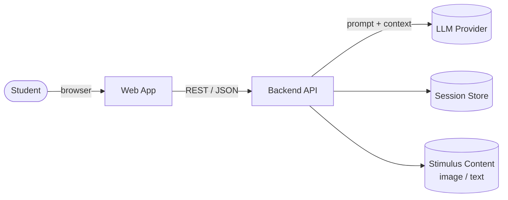
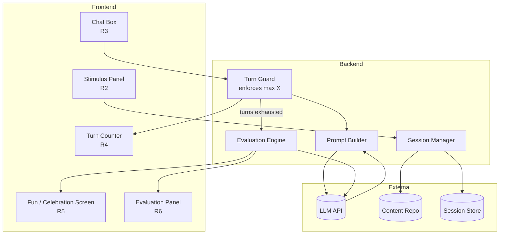
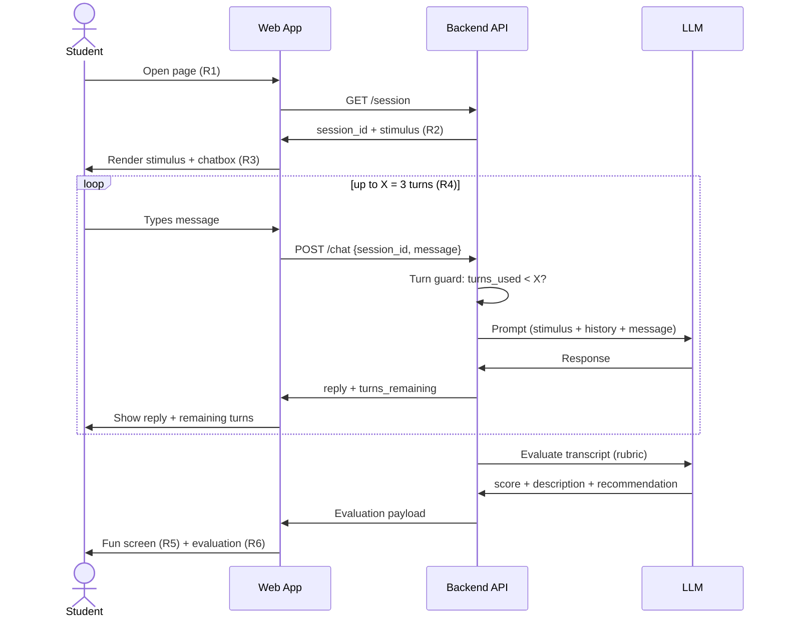
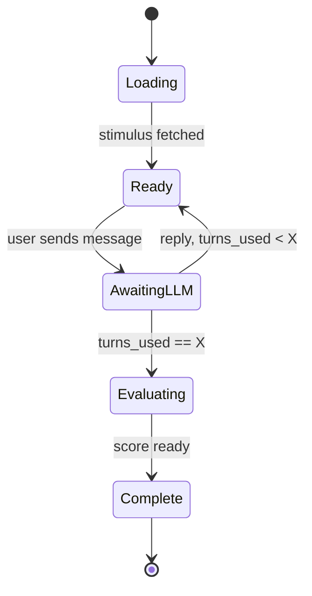
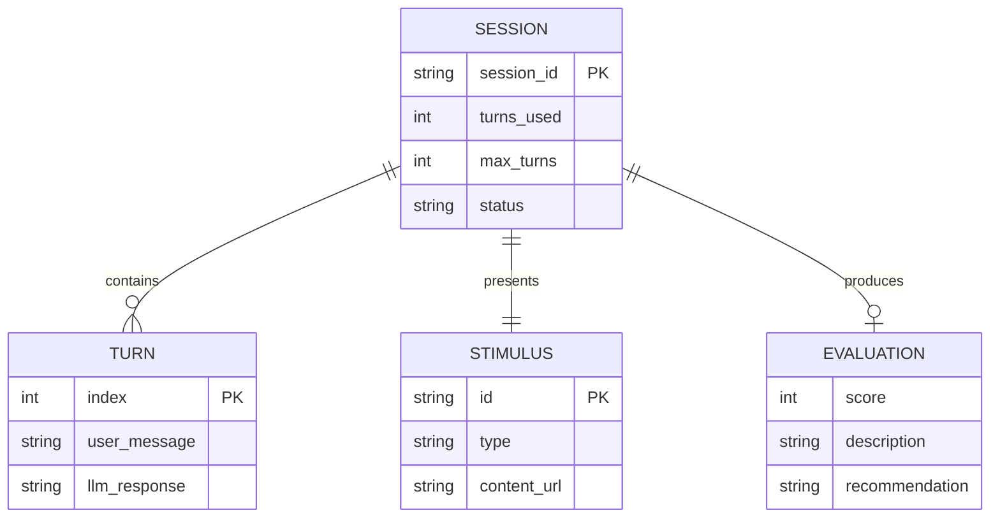

# Architecture — Critical Thinking POC

## Requirements

| # | Requirement |
|---|-------------|
| R1 | A user can go to a web page |
| R2 | The web page displays some information (image or otherwise) |
| R3 | A chatbox is available for the user to interact with the LLM |
| R4 | The user can interact up to **X** times with the LLM (POC: `X = 3`) |
| R5 | A fun screen is shown when they finish interacting |
| R6 | For the POC, the evaluation score, description, and recommendation are displayed to the user |

## System Context



## Component Architecture



## Interaction Flow



## State Machine



## Data Model



## API Surface

| Method | Endpoint | Purpose |
|--------|----------|---------|
| `GET` | `/session` | Create session, return `session_id` + stimulus (R1, R2) |
| `POST` | `/chat` | Send a message, return reply + `turns_remaining` (R3, R4) |
| `GET` | `/evaluation/{session_id}` | Return score, description, recommendation (R6) |

## Key Design Decisions

- **Turn limit enforced server-side.** The Turn Guard is authoritative; the frontend counter is display only, so the cap can't be bypassed.
- **Two LLM roles.** One prompt drives the Socratic conversation; a separate rubric prompt scores the transcript. This keeps coaching and grading concerns separate.
- **Evaluation is post-hoc.** Scoring runs only after the final turn, so it can assess the whole arc of reasoning rather than a single message.
- **Stateless frontend.** All session state lives server-side, keyed by `session_id`, so a refresh doesn't reset progress.
- **`X` is configurable.** Set to 3 for the POC, stored as `max_turns` per session.

## Evaluation Output (R6)

The evaluation engine returns three fields, rendered on the completion screen alongside the fun screen:

```json
{
  "score": 7,
  "description": "You questioned the source of the claim and asked what evidence supported it.",
  "recommendation": "Next time, try asking what information is missing before accepting a conclusion."
}
```
